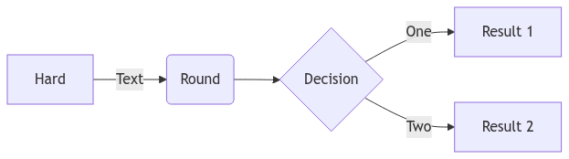

# go-mermaid 

[go-mermaid][] is providing `mmd`, a command-line tool to render [mermaid.js][] diagrams on the console and output SVG/PNG files.

## CLI

The CLI is called `mmd`.

### Install


If you have [Homebrew](https://brew.sh) installed, you can run:

```shell
brew tap mrueg/homebrew-tap
brew install mmd
```

Alternatively, you can download the [Release](https://github.com/mrueg/go-mermaid/releases) or install via

```shell
go install github.com/mrueg/go-wardley/cmd/mmd@latest
```

### Usage

```shell
NAME:
   mmd - Render mermaid diagrams on the command line

USAGE:
   mmd [global options]

VERSION:
   dev - none@unknown

GLOBAL OPTIONS:
   --input string, -i string   Path to file that contains the mermaid diagram (if unset, read from stdin)
   --output string, -o string  Path of the output file (default: diagram.svg / diagram.png)
   --format string, -f string  Output format. Possible values: svg, png (default: "svg")
   --scale float, -s float     For PNG output only, scaling factor of the rendered image (default: 1)
   --log-level string          Set log level: error, warn, info, debug, trace (default: "info")
   --help, -h                  show help
   --version, -v               print the version
```

## Syntax

See [here](https://mermaid.js.org/intro/syntax-reference.html).

## Example

```
flowchart LR

A[Hard] -->|Text| B(Round)
B --> C{Decision}
C -->|One| D[Result 1]
C -->|Two| E[Result 2]
```




## How it works

[go-mermaid][] uses [mermaid.go][] which uses [chromedp][] to execute [mermaid.js][] in a headless Chrome browser and is able to capture the SVG from source code and the PNG as a screenshot of the created mermaid diagram.


## License of the main dependencies

- [mermaid.js][]: MIT License
- [mermaid.go][]: MIT License
- [chromedp][]: MIT License
 
[go-mermaid]: https://github.com/mrueg/go-mermaid
[mermaid.js]: https://mermaid.js.org/
[mermaid.go]: https://github.com/dreampuf/mermaid.go
[chromedp]: https://github.com/chromedp/chromedp

